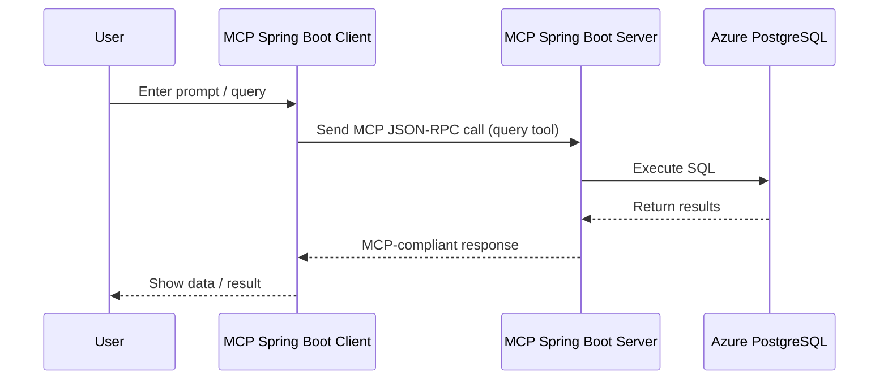

## 📘 Java Spring Boot-Based MCP Integration with Azure Database for PostgreSQL

### 1. Overview

This document outlines the architecture and implementation details for a **custom Java Spring Boot-based MCP Client and MCP Server**, enabling communication with **Azure Database for PostgreSQL**. The setup adheres to the [Model Context Protocol (MCP)](https://modelcontextprotocol.io/) standard and allows secure, structured interaction between an LLM-based UI and a PostgreSQL database using Java-based services only.

---

### 2. Architecture

#### 2.1 High-Level Architecture

```mermaid
flowchart LR
  A[Spring Boot MCP Client (Custom UI / Prompt UI)] --> |MCP RPC| B[Spring Boot MCP Server]
  B --> C[(Azure PostgreSQL DB)]
  B --> D[Auth Layer (Azure Entra / Secrets)]
```

---

### 3. Component Overview

#### 3.1 Java Spring Boot MCP Client

**Responsibilities:**

* UI-based or REST-based prompt system for generating MCP requests
* Use [Java MCP Client SDK](https://modelcontextprotocol.io/sdk/java/mcp-client) for compliant RPC message formats
* Handle response parsing and formatting

**Spring Components:**

* `McpClientService`: Manages connections and sends MCP requests
* `PromptController`: REST endpoint to initiate query requests
* `McpRequestBuilder`: Helper to structure messages as per MCP
* `McpResponseHandler`: Maps the received response

#### 3.2 Java Spring Boot MCP Server

**Responsibilities:**

* Act as a bridge between MCP client and Azure PostgreSQL
* Implements supported MCP tools (`query`, `insert`, `listSchemas`, etc.)
* Provides authentication and secure access to PostgreSQL

**Spring Components:**

* `McpServerApplication`: Main app entrypoint
* `RpcDispatcherController`: Handles JSON-RPC requests
* `PostgresToolHandler`: Executes mapped SQL actions
* `AuthConfig`: Manages secrets or Azure Entra connection strings
* `PostgresConnector`: JDBC/PostgreSQL client logic (using Spring Data / JPA optional)

**MCP Server SDK:** Use [Java MCP Server SDK](https://modelcontextprotocol.io/sdk/java/mcp-server)

---

### 4. Sequence Diagram



---

### 5. Flowchart - Query Execution

```mermaid
flowchart TD
  A[User input prompt] --> B[Build MCP request (Java SDK)]
  B --> C[POST to MCP Server via JSON-RPC]
  C --> D[Execute Handler for Tool: Query]
  D --> E[Run SQL via JDBC to Azure PostgreSQL]
  E --> F[Return Data]
  F --> G[Format into MCP ToolResponse]
  G --> H[Return response to client]
  H --> I[Show result to user]
```

---

### 6. Prerequisites

#### Azure Environment

* Azure PostgreSQL Flexible Server
* Public IP allowed / VNet integration
* Azure Entra ID (for auth) or password-based DB user

#### Java Environment

* JDK 17+
* Spring Boot 3.x
* Maven/Gradle
* Java MCP SDKs:

  * [mcp-client](https://modelcontextprotocol.io/sdk/java/mcp-client)
  * [mcp-server](https://modelcontextprotocol.io/sdk/java/mcp-server)
* JDBC Driver for PostgreSQL

---

### 7. Application Configuration

#### `application.yml`

```yaml
spring:
  datasource:
    url: jdbc:postgresql://<host>:5432/<db>
    username: <user>
    password: <password>

mcp:
  enabled-tools:
    - query
    - listSchemas
    - insert
    - listTables
```

---

### 8. Sample Tool Handler - Query

```java
@Component("query")
public class QueryToolHandler implements ToolHandler {
  @Autowired
  private PostgresConnector postgresConnector;

  @Override
  public ToolResponse handle(ToolRequest request) throws ToolException {
    String sql = request.getInputs().get("sql");
    List<Map<String, Object>> result = postgresConnector.executeQuery(sql);
    return ToolResponse.success(Map.of("rows", result));
  }
}
```

---

### 9. Usage Examples - Prompt to SQL Execution

#### Example 1: Prompt

> “Show me the latest 5 orders from the orders table”

```java
ToolRequest request = ToolRequest.builder()
    .toolName("query")
    .inputs(Map.of("sql", "SELECT * FROM orders ORDER BY created_at DESC LIMIT 5"))
    .build();
ToolResponse response = mcpClientService.send(request);
```

**Expected MCP Response:**

```json
{
  "jsonrpc": "2.0",
  "id": "123",
  "result": {
    "toolName": "query",
    "outputs": {
      "rows": [
        { "order_id": 101, "customer_name": "John Doe", "amount": 250.75, "created_at": "2025-07-03T18:45:00" },
        { "order_id": 100, "customer_name": "Jane Smith", "amount": 199.99, "created_at": "2025-07-03T14:21:00" }
      ]
    }
  }
}
```

#### Other Prompts → SQL:

* "Get all employees from department HR"

  ```sql
  SELECT * FROM employees WHERE department = 'HR';
  ```
* "How many users signed up in the last 7 days?"

  ```sql
  SELECT COUNT(*) FROM users WHERE signup_date >= NOW() - INTERVAL '7 days';
  ```
* "List all product names and prices where price is above 500"

  ```sql
  SELECT product_name, price FROM products WHERE price > 500;
  ```

---

### 10. NLP-to-SQL Integration (Optional)

To convert natural prompts into SQL dynamically, you can integrate an LLM like OpenAI, or use an open-source NLP-to-SQL engine like **Text-to-SQL**.

#### Open Source Option: [Text2SQL T5 Model](https://github.com/salesforce/TabularSemanticParsing)

**Flowchart:**

```mermaid
flowchart TD
  A[User enters natural prompt] --> B[NLP-to-SQL Engine (T5, OpenAI, etc)]
  B --> C[Spring Boot MCP Client builds ToolRequest]
  C --> D[MCP Server handles query]
  D --> E[Query Azure PostgreSQL]
  E --> F[Return result]
```

#### Code Integration:

```java
String prompt = "List top 5 customers by revenue";
String sql = textToSqlService.convert(prompt); // T5 or OpenAI based
ToolRequest request = new ToolRequest("query", Map.of("sql", sql));
ToolResponse response = mcpClientService.send(request);
```

---

### 11. ADR Summary (Architecture Decisions)

| Decision                    | Status           | Reason                                       |
| --------------------------- | ---------------- | -------------------------------------------- |
| Java Spring Boot-only stack | ✅ Accepted       | Unified stack, enterprise ready              |
| MCP JSON-RPC over HTTP      | ✅ Accepted       | MCP-compliant protocol                       |
| Direct JDBC vs ORM          | ✅ JDBC preferred | Fine control for raw SQL execution           |
| Auth via Entra ID           | Optional         | Secure production setup; fallback to secrets |
| Optional NLP-to-SQL layer   | Optional         | Enhances usability for non-technical prompts |

---

### 12. Future Enhancements

* Add support for `update`, `delete`, `schema introspection` tools
* Add `MCP Guardian` permissions system
* Multi-tenant support
* Integration with LLM-enabled frontend UI
* Embed open-source text-to-SQL model for full NLP prompt flow

---

### 13. References

* [Azure PostgreSQL MCP Blog](https://techcommunity.microsoft.com/blog/adforpostgresql/introducing-model-context-protocol-mcp-server-for-azure-database-for-postgresql-/4404360)
* [Java MCP SDK](https://github.com/modelcontextprotocol/java-sdk)
* [MCP Protocol Spec](https://modelcontextprotocol.io)
* [Azure Samples](https://github.com/Azure-Samples/azure-postgresql-mcp)
* [Text2SQL Model by Salesforce](https://github.com/salesforce/TabularSemanticParsing)
