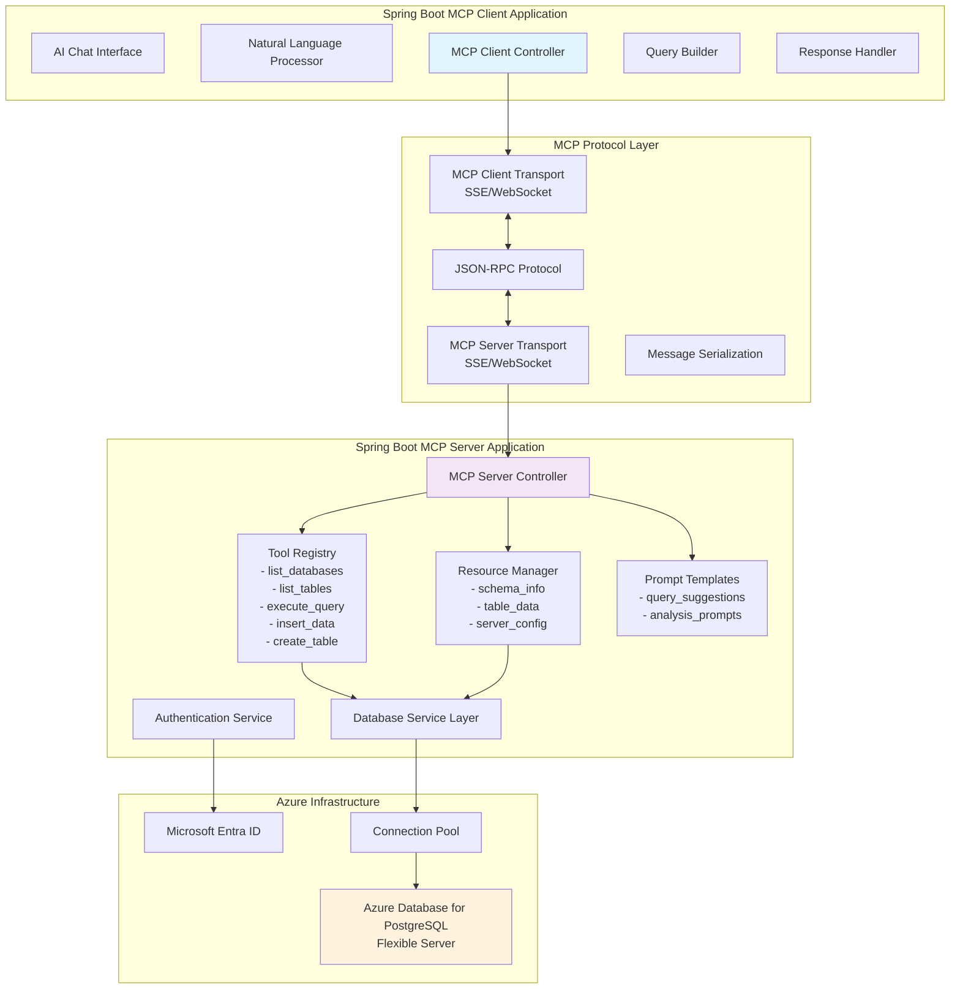
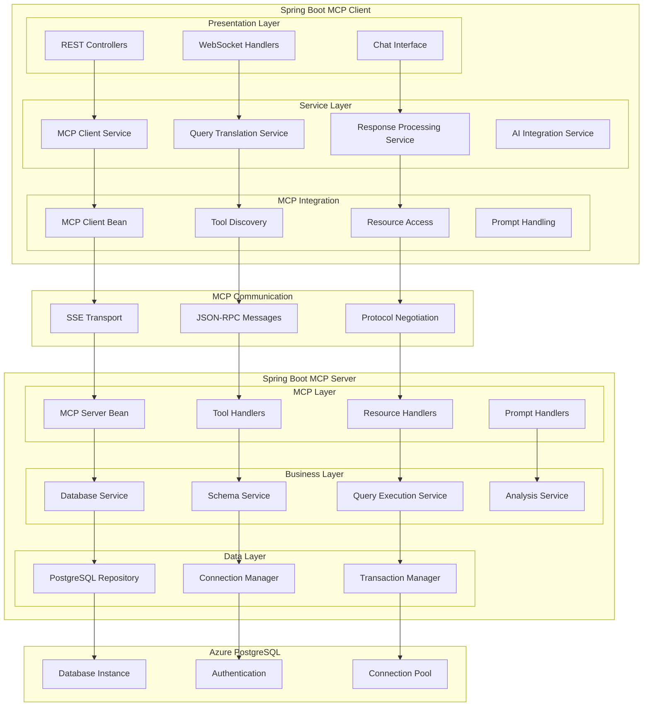
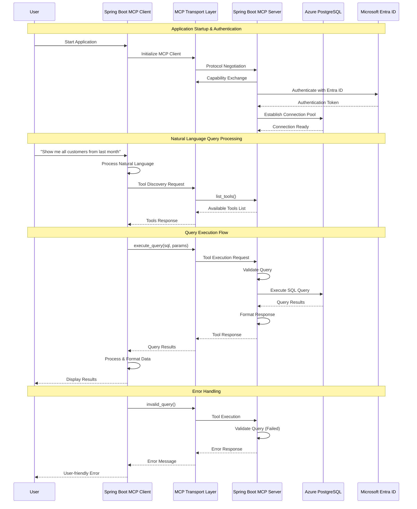
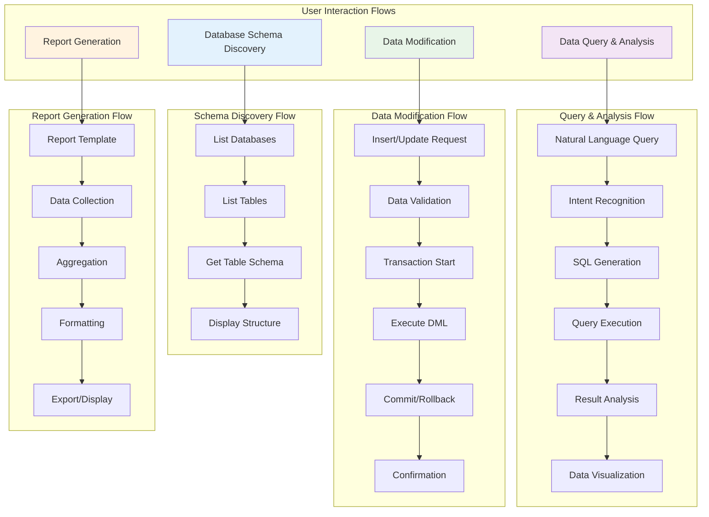
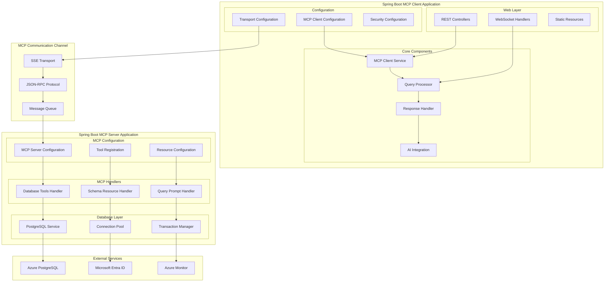
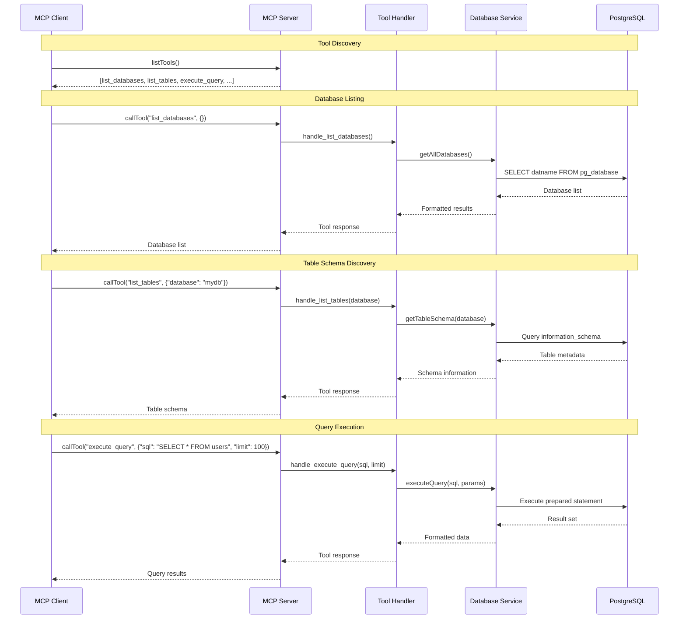
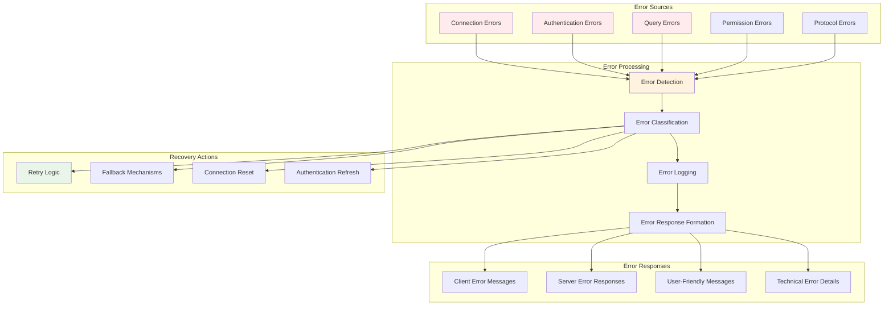

# Spring Boot MCP Architecture for Azure PostgreSQL Integration

## 1. High-Level Architecture (HLD) Diagram

## 2. Logical Component Diagram

## 3. Sequence Diagram - Complete Flow

## 4. Data Flow Diagram

```mermaid
graph LR
    subgraph "Input Processing"
        I1[Natural Language Input]
        I2[Query Intent Analysis]
        I3[Parameter Extraction]
    end
    
    subgraph "MCP Client Processing"
        C1[Tool Selection]
        C2[Request Formation]
        C3[MCP Message Creation]
    end
    
    subgraph "Transport Layer"
        T1[Message Serialization]
        T2[SSE/WebSocket Transport]
        T3[Message Deserialization]
    end
    
    subgraph "MCP Server Processing"
        S1[Tool Handler Routing]
        S2[Parameter Validation]
        S3[SQL Generation]
        S4[Query Execution]
    end
    
    subgraph "Database Layer"
        D1[Connection Pool]
        D2[Query Processor]
        D3[Result Set]
        D4[Metadata Extraction]
    end
    
    subgraph "Response Processing"
        R1[Data Formatting]
        R2[Response Serialization]
        R3[Client Processing]
        R4[User Presentation]
    end
    
    I1 --> I2
    I2 --> I3
    I3 --> C1
    C1 --> C2
    C2 --> C3
    C3 --> T1
    T1 --> T2
    T2 --> T3
    T3 --> S1
    S1 --> S2
    S2 --> S3
    S3 --> S4
    S4 --> D1
    D1 --> D2
    D2 --> D3
    D3 --> D4
    D4 --> R1
    R1 --> R2
    R2 --> R3
    R3 --> R4
```

## 5. Usage Flow Diagram

## 6. Component Integration Diagram

## 7. Tool Execution Flow

## 8. Error Handling Flow

